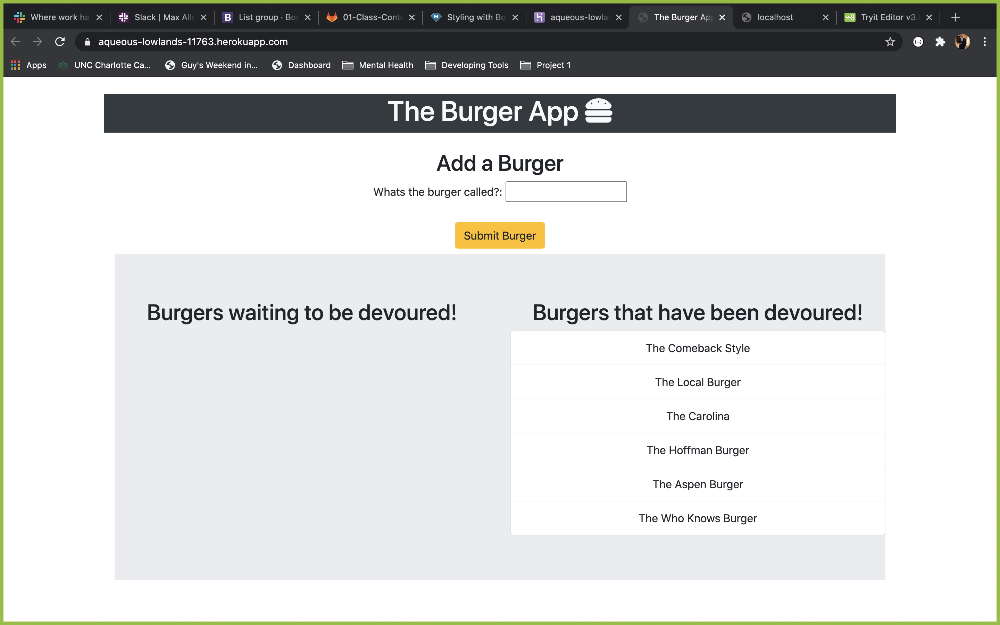

# The Burger App
## Description

This application allows the user to input a burger and then devour it!
 ## Table of Contents

 1. [Installation](#installation)
 2. [Usage](#usage)
 3. [License](#license)
 4. [Contributing](#contributing)
 5. [Tests](#tests)
 6. [Questions](#questions)

## Installation

Run NPM I

## Usage

Input your burger and then when you're huggry click "It's time to GRUB"

## License

## Contributing

No thank you

## Tests

Go to the url

## Visuals

## Questions

You made it this far! If you have questions contact me on [GitHub] (http://github.com/gkourako).  If not you can email me at georgekourakos4@gmail.com
